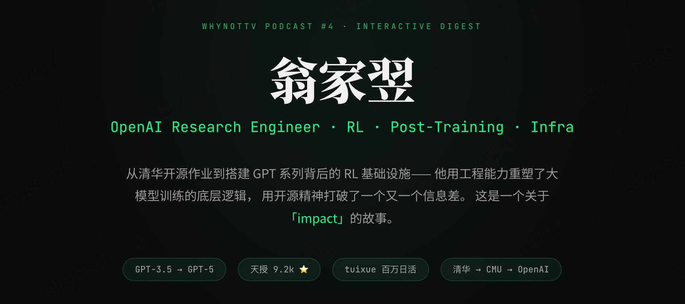

# 翁家翌 × WhynotTV Podcast #4 · Interactive Digest

> 🎙️ 一个两小时深度播客的交互式精华提炼——从清华开源作业到搭建 GPT 系列背后的 RL 基础设施。

---

## ✨ 关于这个项目

这是 [WhynotTV Podcast #4](https://www.youtube.com/watch?v=I0DrcsDf3Os) 的交互式网页版精华摘要。原播客长达 2 小时+，嘉宾是 OpenAI 研究工程师**翁家翌（Jiayi Weng）**，主持人是**何泰然**。

本项目将播客中的核心内容、独特观点和人生哲学提炼为一个可交互浏览的单页应用，让你在 5-10 分钟内 get 到整期对谈的精华。

## 📖 内容板块

| 板块 | 说明 |
|------|------|
| `//init` | 打字机动画开场，快速了解翁家翌是谁 |
| `//journey` | 可展开的人生时间线——从奥数少年到 GPT 核心贡献者 |
| `//values` | 六条底层价值观卡片，每张附带反思提问 |
| `//openai` | 来自 OpenAI 内部的一手技术观察与行业判断 |
| `//insights` | 最犀利的六条观点金句 |
| `//worldview` | 宿命论者的实用主义哲学 |

## 🎯 核心观点速览

- **Infra 决定上限** — 模型公司本质上拼的是修 Bug 的速度
- **Idea 是廉价的** — 关键是单位时间内能验证多少次
- **工程 > 研究** — 教 Researcher 做 Engineering 比反过来难得多
- **Context 决定一切** — 人和人之间的差距本质是信息差
- **开源是一种慈善** — 不是履历装饰，而是对世界的投入方式
- **Researcher 最先被 AI 替代** — 然后是工程师，最难替代的是 Sales

## 🛠️ 技术栈

- **React 18** — 组件化 UI
- **Vite** — 极速构建工具
- **纯 CSS** — 无 UI 框架依赖，终端美学设计风格

## 🎨 设计理念

UI 风格灵感来自翁家翌的人格特质——工程师/黑客气质、崇尚开源、追求 impact：

- **终端美学**：深色背景 + JetBrains Mono 等宽字体 + 绿色荧光主色调
- **`//comment` 导航**：用代码注释风格标记每个板块
- **`jiayi@openai:~$`**：顶部导航栏模拟终端提示符
- **交互优先**：时间线可展开、价值观卡片有反思提问、观点 Tab 切换

## 📋 播客信息

- **节目**：WhynotTV Podcast #4
- **嘉宾**：翁家翌（Jiayi Weng）— OpenAI Research Engineer
- **主持**：何泰然（Tairan He）
- **时长**：2 小时 +
- **原视频**：[YouTube](https://www.youtube.com/watch?v=I0DrcsDf3Os) ｜ [Bilibili](https://www.bilibili.com/video/BV1darmBcE4A/)

## 📄 License

MIT — 内容基于公开播客整理，仅供学习交流。

---

  <i>「如果人生是一场游戏，那么游戏的结算分数是你去世后认识你的人的数量。」</i>
   
  — 翁家翌

